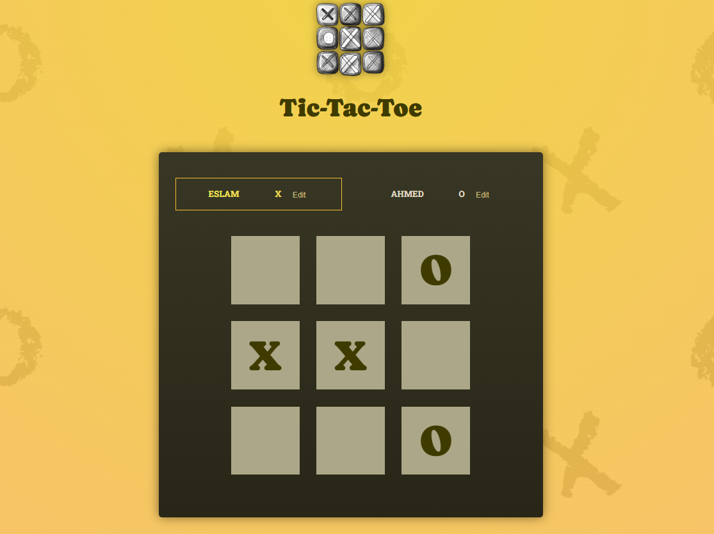

# 🎮 React Tic-Tac-Toe

A modern, interactive Tic-Tac-Toe game built with React and Vite. Features a clean UI, player name editing, game history, and winner detection.



## ✨ Features

- **Interactive Gameplay**: Click on any square to place your symbol
- **Player Management**: Edit player names by clicking the "Edit" button
- **Real-time Updates**: See whose turn it is with active player highlighting
- **Winner Detection**: Automatic detection of winning combinations
- **Draw Detection**: Identifies when the game ends in a tie
- **Game History**: View the complete log of moves made during the game
- **Restart Functionality**: Start a new game with the rematch button
- **Responsive Design**: Works on desktop and mobile devices

## 🚀 Getting Started

### Prerequisites

Make sure you have the following installed:
- [Node.js](https://nodejs.org/) (version 14 or higher)
- npm (comes with Node.js)

### Installation

1. Clone the repository:
   ```bash
   git clone https://github.com/Eslamsaeed880/Tic-Tac-Teo.git
   cd Tic-Tac-Teo
   ```

2. Install dependencies:
   ```bash
   npm install
   ```

3. Start the development server:
   ```bash
   npm run dev
   ```

4. Open your browser and navigate to `http://localhost:5173`

## 🎯 How to Play

1. **Starting the Game**: The game starts with Player X
2. **Making Moves**: Click on any empty square to place your symbol
3. **Player Turns**: Players alternate turns automatically
4. **Winning**: Get three of your symbols in a row (horizontally, vertically, or diagonally)
5. **Editing Names**: Click the "Edit" button next to a player's name to customize it
6. **Restarting**: Click "Rematch" when the game ends to play again

## 🛠️ Built With

- **React** - Frontend library for building user interfaces
- **Vite** - Build tool and development server
- **JavaScript (ES6+)** - Programming language
- **CSS3** - Styling and layout
- **HTML5** - Structure and markup

## 📁 Project Structure

```
tic-tac-teo/
├── public/
│   ├── bg-pattern-dark.png
│   ├── bg-pattern.png
│   └── game-logo.png
├── src/
│   ├── components/
│   │   ├── GameBoard.jsx      # Main game board component
│   │   ├── Player.jsx         # Player display and editing
│   │   ├── GameOver.jsx       # Game over screen
│   │   ├── Log.jsx           # Move history display
│   │   └── winning-combinations.js  # Winning patterns
│   ├── App.jsx               # Main application component
│   ├── index.css            # Global styles
│   └── index.jsx            # Application entry point
├── index.html               # HTML template
├── package.json            # Dependencies and scripts
├── vite.config.js          # Vite configuration
└── README.md               # This file
```

## 🎨 Key Components

### GameBoard
- Renders the 3x3 game grid
- Handles click events for placing symbols
- Prevents moves on already occupied squares

### Player
- Displays player information and symbols
- Allows inline editing of player names
- Shows active player highlighting

### GameOver
- Displays win/draw messages
- Provides restart functionality

### Log
- Shows chronological history of moves
- Displays which player made each move

## 🚀 Available Scripts

- `npm run dev` - Start development server
- `npm run build` - Build for production
- `npm run preview` - Preview production build
- `npm run lint` - Run ESLint (if configured)

## 🎮 Game Logic

The game implements several key features:

- **Turn Management**: Uses derived state to determine the current player
- **Move Validation**: Prevents placing symbols on occupied squares
- **Winner Detection**: Checks all possible winning combinations after each move
- **State Management**: Uses React hooks for managing game state
- **Immutable Updates**: Ensures proper state updates for React re-rendering

## 🤝 Contributing

1. Fork the project
2. Create your feature branch (`git checkout -b feature/AmazingFeature`)
3. Commit your changes (`git commit -m 'Add some AmazingFeature'`)
4. Push to the branch (`git push origin feature/AmazingFeature`)
5. Open a Pull Request

## 📝 License

This project is open source and available under the [MIT License](LICENSE).

## 🙏 Acknowledgments

- Built as a learning project for React fundamentals
- Inspired by the classic Tic-Tac-Toe game
- Thanks to the React and Vite communities for excellent documentation

## 📞 Contact

If you have any questions or suggestions, feel free to reach out!

---

**Enjoy playing Tic-Tac-Toe! 🎉**
